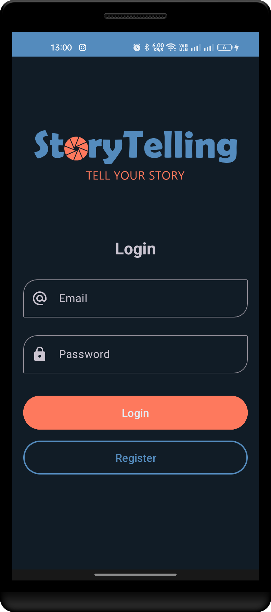
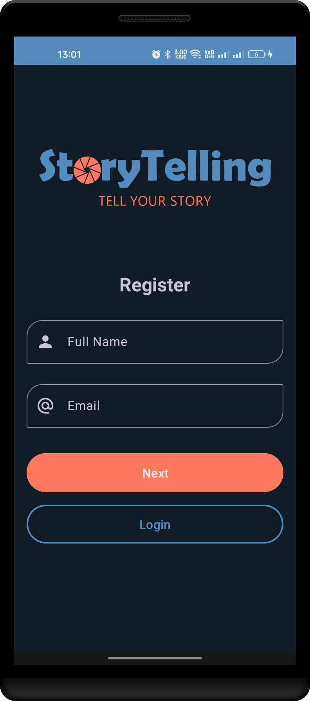
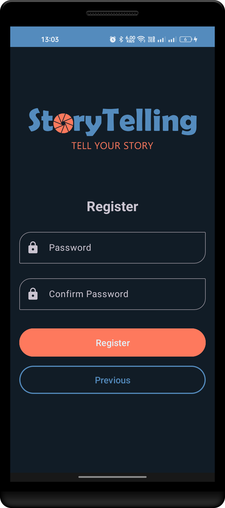
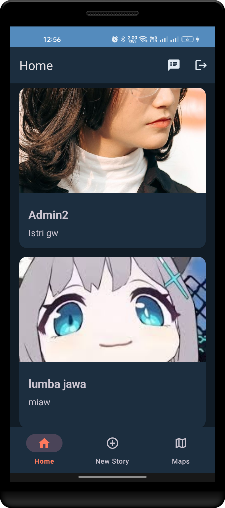
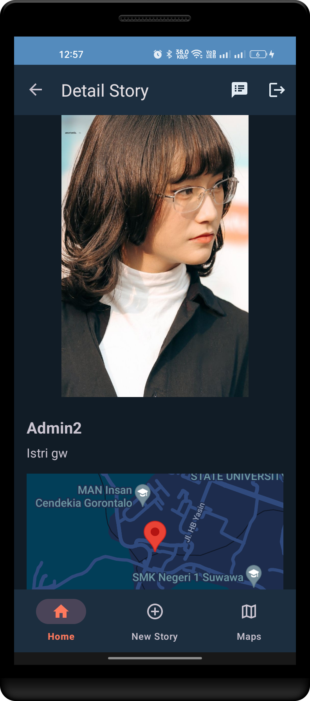
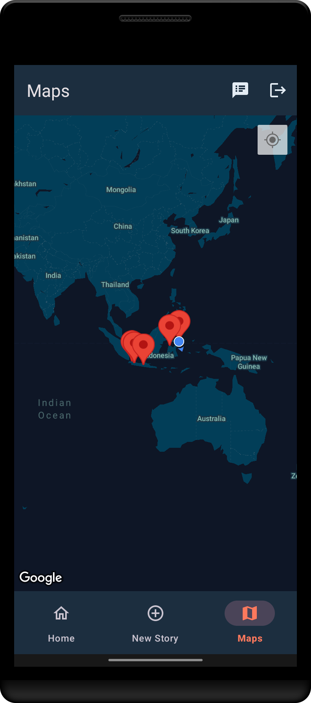
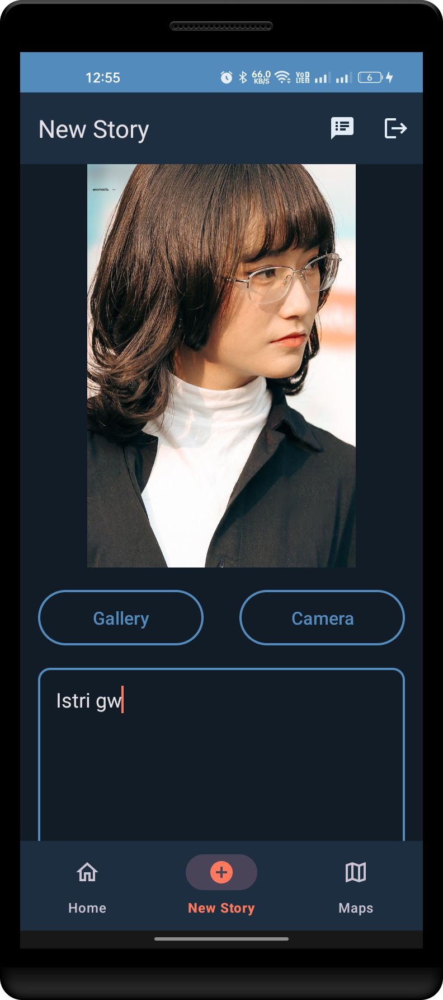
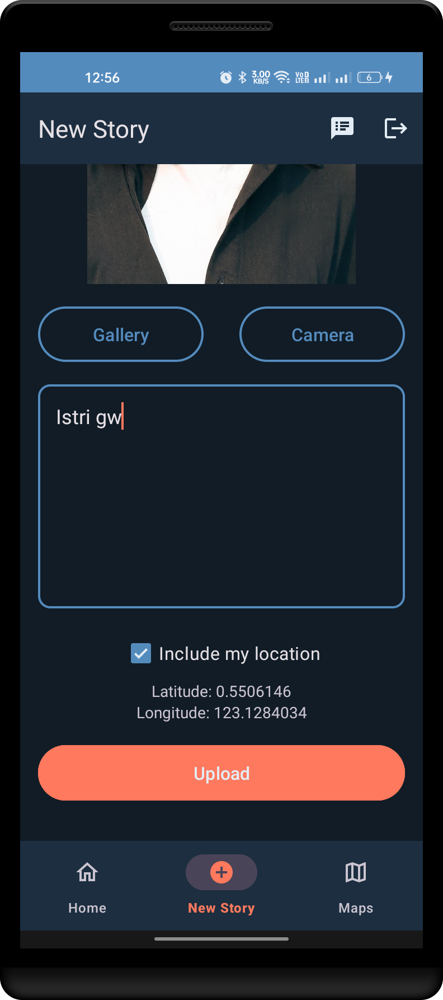
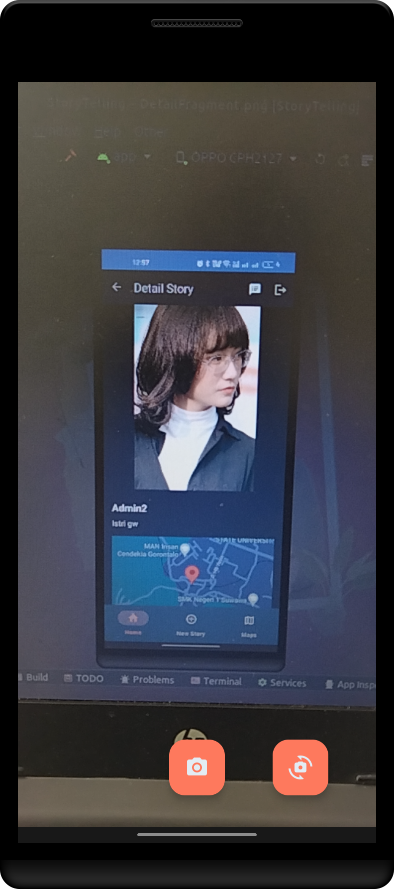

  

   

  

    This is a simple project to show user story from <a href="https://story-api.dicoding.dev/v1/">Dicoding Story API</a>. This application was created as a submission to the <a href="https://www.dicoding.com/academies/352/">Belajar Pengembangan Aplikasi Android Intermediate</a> course in Dicoding.
  

## Preview

<table>
  <tr>
    <th style="text-align: center">Login</th>
    <th colspan="2" style="text-align: center">Register</th>
  </tr>
  <tr>
    <td></td>
    <td></td>
    <td></td>
  </tr>
  <tr><td colspan="3"></td></tr>
  <tr><td colspan="3"></td></tr>
  <tr>
    <th style="text-align: center">Home</th>
    <th style="text-align: center">Detail</th>
    <th style="text-align: center">Maps</th>
  </tr>
  <tr>
    <td></td>
    <td></td>
    <td></td>
  </tr>
  <tr><td colspan="3"></td></tr>
  <tr><td colspan="3"></td></tr>
  <tr>
    <th colspan="2" style="text-align: center">Add Story</th>
    <th style="text-align: center">Camera</th>
  </tr>
  <tr>
    <td></td>
    <td></td>
    <td></td>
  </tr>
</table>

## Key Features

- [x] Get all stories
- [x] Get all stories with location
- [x] Get story by id
- [x] Add story with or without location
